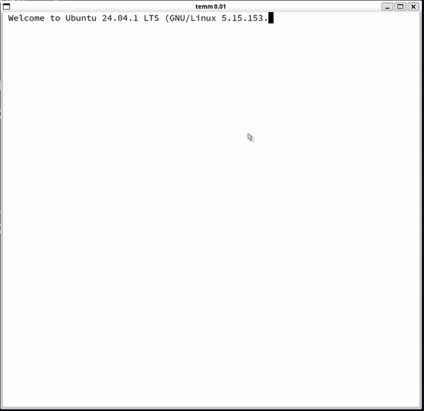

>[!NOTE]
> Currently in development

# temm - terminal emulator
- tell (and) evaluate (on) my machine - terminal emulator
- A very basic and minimal terminal built using the default X11/Xlib (X-Window System), hence making it capable of running on virtually
  every linux distribution

# Demo


# How to use?

## Pre-requisites
- [1] `gcc` or any other c compiler
- [2] Cmake (>= v3.10)
- [3] Xft-lib: https://manpages.debian.org/testing/libxft-dev/Xft.3.en.html
  - `sudo apt install libx11-dev libxft-dev`

## Setup
- [1] First make sure you have a `monospace` font installed on your system, if not you
can get one from the `fonts` directory and install it on your system.
- [2] You can edit the preferred font by editing the following line of code in `main.c; line=23`:
  ```
  char *fontname = "<yourfontname>.ttf:size=15";
  ```
- [3] You now have to select your preferred shell, I recommend using `dash` because in the
current state, temm cannot render [Nerd Fonts](https://www.nerdfonts.com/), hence if you are
using any fancy prompts like `oh-my-fish` or `starship` then the results could be a little glitchy.
  - Check if you have `dash` installed: 
  ```
  which dash
  ```
  - And if it is installed you should see:
  ```
  /usr/bin/dash
  ```
  - If you do not have `dash` installed, then you can select your preferred shell by editing `main.c; line=27,28`
  ```
  const char *shell = "/bin/dash";
  const char *login = "-/bin/dash";
  // Note: By convention, shells (like bash or dash) treat an argument starting 
    with "-" as an indicator to run in login mode.
  ```
- [4] Now you can build!

## Build:
- [1] Create a `build` directory and `cd build` into it.
- [2] `cmake ..`
- [4] `cmake --build .`
- [3] `./temm`

## Sources and References
- [1]: X11/Xlib.c Docs: https://www.x.org/docs/X11/xlib.pdf
- [2]: Eduterm: https://www.uninformativ.de/git/eduterm/file/README.html
- [3]: tty/pty (Linux Manual Page): https://man7.org/linux/man-pages/man7/pty.7.html
- [4]: Monospace font used in testing : https://github.com/be5invis/Iosevka/releases/tag/v31.9.1
